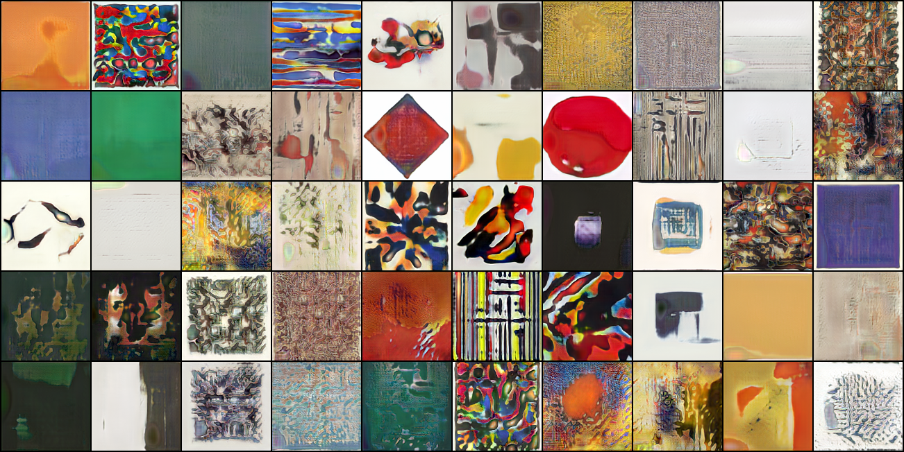
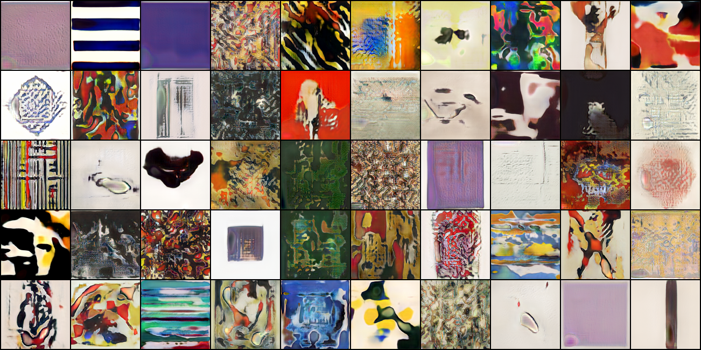

# Style-Based GAN in PyTorch

We used the proposed architecture in https://arxiv.org/abs/1812.04948 and from this implementation in PyTorch we trained the model with a paintings dataset.

Usage: python train.py --mixing -d {folder} PATH

However, we ran it on a cluster so we just had to execute the bash scripts.

## Sample

Here are the 10 latest generated samples after approx. 3.5 days of training.

### 1st

### 2nd

### 3rd

### 4th

### 5th

### 6th

### 7th

### 8rd

### 9nd

### 10th

